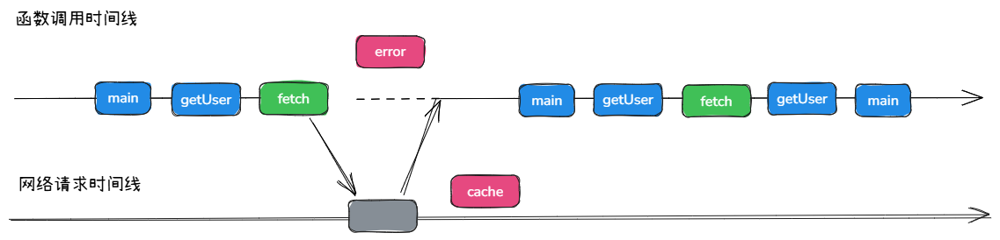
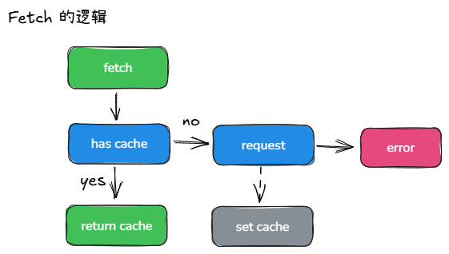

在函数式编程场景中，下述代码存在异步传染性问题：

```js
async function getUser() {
  return await fetch('./user.json')
}

async function m1() {
  return await getUser()
}

async function m2() {
  return await m1()
}

async function main() {
  return await m2()
}
```

原本具备纯函数特性的 m1、m2、main 函数，因顶层调用的异步操作产生副作用。

函数式编程要求尽可能保持函数纯净，因此需消除这种异步传染性，核心目标是移除代码中所有的 `async` 和 `await` 关键字，同时保证功能正常运行。

分析上述代码可知，函数异步化的根源是 getUser 函数中的 fetch 调用。

这就意味着只要将 fetch 修改成同步函数即可。

但关键是，fetch 作为网络 IO 操作，本身具备异步特性，直接改为同步调用会导致浏览器阻塞。

这里借助 React 进阶特性来实现无阻塞的同步化改造，如图所示：



图中包含两条时间线，展示核心调用逻辑：main 函数调用 getUser 函数（省略 m1、m2 调用链路），getUser 函数调用 fetch 方法。

改造后的 fetch 执行逻辑分为两步：

1. 发送网络请求；
2. 立即抛出错误以中断代码执行，保证同步执行特性。

网络请求发出后，等待请求结果返回并完成缓存，随后通知主线程重新调用 main 函数。

main 函数会被调用两次，由于其纯函数特性，多次调用不会产生副作用。

二次调用时，fetch 不再发起新的网络请求，而是直接返回缓存的请求结果，使 getUser 及后续调用链路均以同步方式执行。

既然要去改造 fetch 函数，那如何改造呢？



图中展示了 fetch 改造后的核心逻辑：

- 存在缓存(has cache)时，直接返回缓存数据(return cache)；
- 无缓存时，发起网络请求(request)但不等待结果，立即抛出错误(error)；
- 网络请求完成后，将结果存入缓存(set cache)，并触发 main 函数重新执行。

<br><br>

__代码实现__

虽然需要修改 fetch 函数，但是不推荐直接修改 `window.fetch`，这影响范围过于庞大。

所以我们通过封装 run 函数管控 fetch 行为，函数的基础结构：

```js
function run(func) {
  // 1. 保存原生 fetch
  const oldFetch = window.fetch

  // 2. 定义并替换为新的 fetch 方法
  function newFetch(...args) {}
  window.fetch = newFetch

  // 3. 执行目标函数
  func()

  // 4. 恢复原生 fetch
  window.fetch = oldFetch
}

```

接下来就是实现 newFetch 的逻辑，它内部依赖缓存机制实现逻辑，缓存对象包含两个核心属性：

- `status` ：请求状态，默认值 `pending`，可选值为 `pending`（请求中）、`fulfilled`（已完成）、`rejected`（已拒绝）；
- `value` ：缓存值，默认值为 `null`，存储请求成功的返回数据或失败的错误信息。

完整实现代码：

```js
function run(func) {
  // 保存原生 fetch
  const oldFetch = window.fetch

  // 初始化缓存对象
  const cache = {
    status: 'pending', // 'pending' | 'fulfilled' | 'rejected'
    value: null
  }

  // 定义改造后的 fetch 方法
  function newFetch(...args) {
    // 缓存已完成，返回缓存值
    if (cache.status === 'fulfilled') {
      return cache.value
    }
    // 缓存已拒绝，抛出缓存的错误
    if (cache.status === 'rejected') {
      throw cache.value
    }

    // 无缓存时发起原生请求
    const p = oldFetch(...args)
      .then(res => res.json())
      .then((res) => {
        // 请求成功，更新缓存状态和值
        cache.status = 'fulfilled'
        cache.value = res
      })
      .catch((err) => {
        // 请求失败，更新缓存状态和错误信息
        cache.status = 'rejected'
        cache.value = err
      })
    
    // 立即抛出 Promise，中断同步执行
    throw p
  }

  // 替换全局 fetch
  window.fetch = newFetch

  // 执行目标函数并捕获错误
  try {
    func()
  } catch (err) {
    // 捕获到 Promise 错误时，等待请求完成后重新执行目标函数
    if (err instanceof Promise) {
      err.finally(() => {
        // 重新替换 fetch 并执行函数
        window.fetch = newFetch
        func()
        // 恢复原生 fetch
        window.fetch = oldFetch
      })
    }
  }

  // 恢复原生 fetch
  window.fetch = oldFetch
}
```

上述实现中，main 函数会被执行两次，该行为与 React 中的 `Suspense` 组件逻辑一致：当组件内部返回 Promise 时，渲染 `Suspense` 的 fallback 属性值；请求完成后，渲染目标子组件。

不难发现，解决思路的核心是**通过缓存和错误中断**，通过抛出 Promise 中断执行，请求完成后缓存结果并重新执行函数，二次调用直接返回缓存数据，这样才将异步 IO 操作转化为同步执行逻辑。

